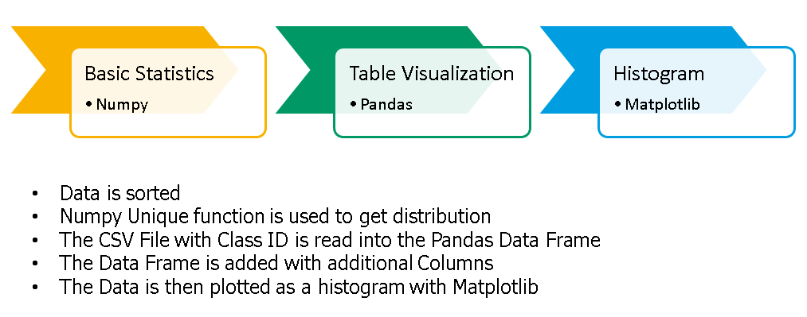
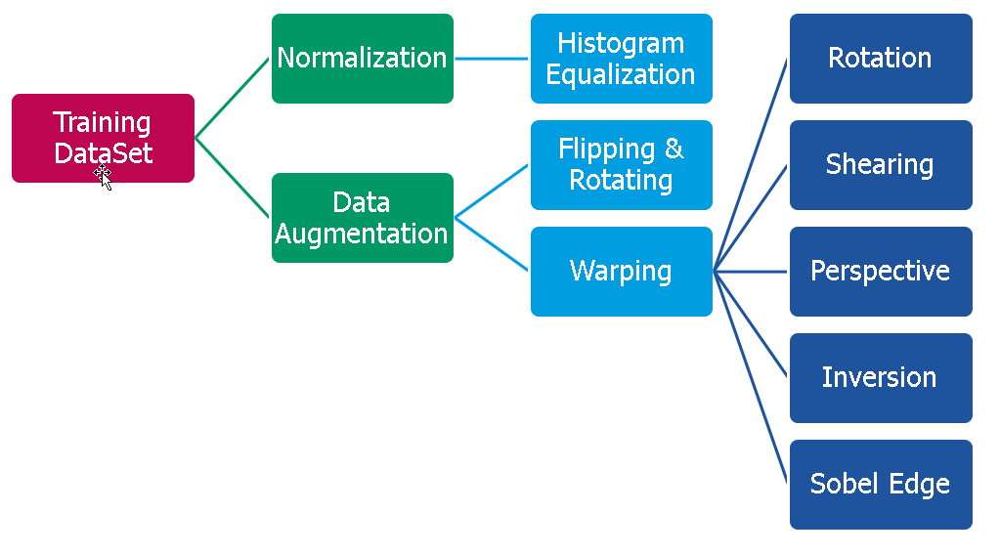
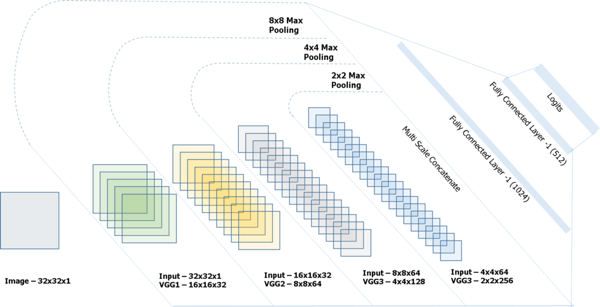
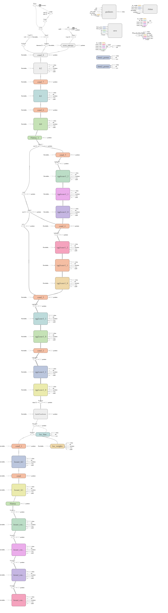
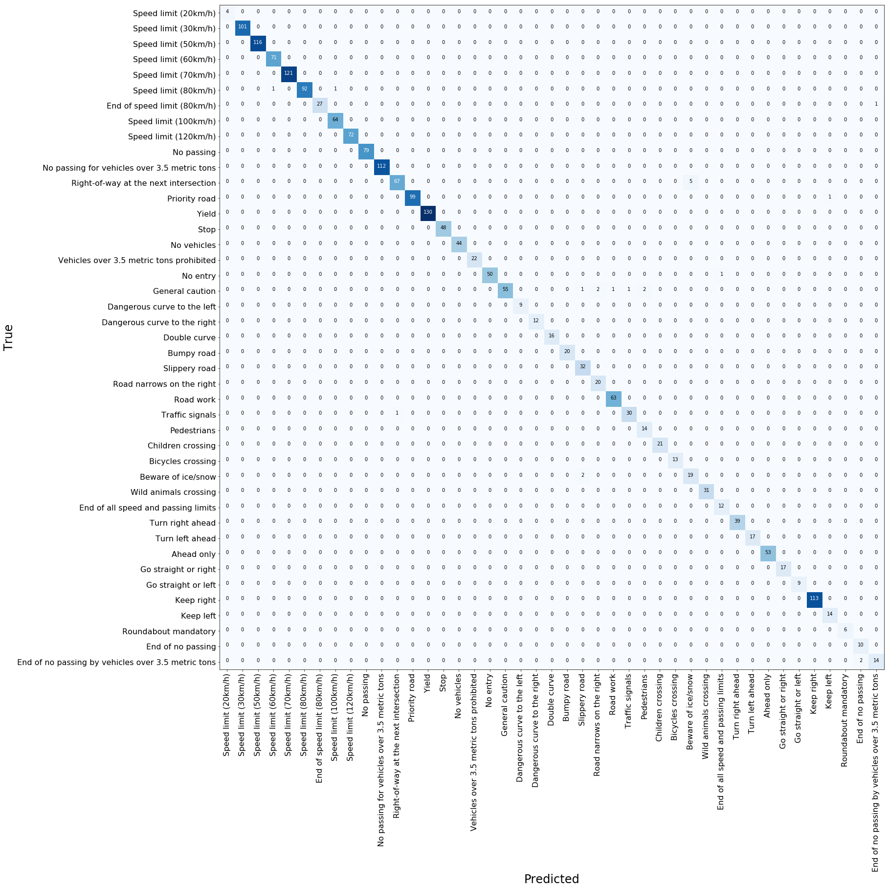
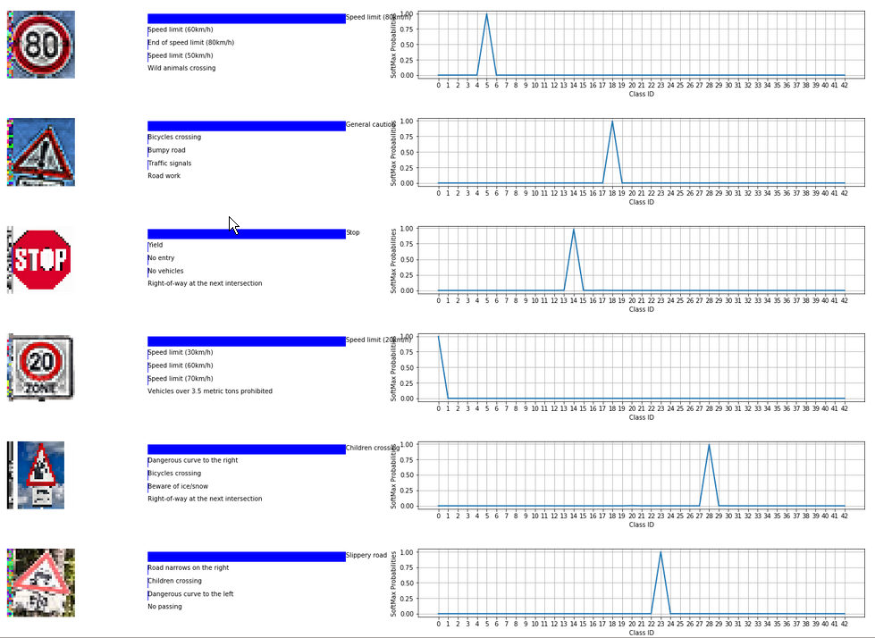

# TrafficSignRecognition
A Deep Neural Network to do traffic sign recognition
* A lot has happened since MobilEye developed the first commercially deployed traffic sign recognition system in collaboration with Continental AG for the BMW-7 series vehicles. Quite a few vehicles have used this technology since. 
* Establishing a reliable Traffic Sign Classification mechanism is a major step in our journey towards building semi-autonomous/autonomous driving systems.
* This post intends to explain an approach to solve the problem of traffic sign classification and I intend to show how easy it is, to build, train and deploy a deep learning network for traffic sign classification.

# Highlights of this approach
* The traffic sign dataset that we will be working on is GTSRB — German Traffic Signs. 
* The approach used is deep learning.
* The type of neural network used is a Convolutional Neural Network (CNN) paired with a linear classifier.
* Python is the language used to program this.
* The complete source code can be found here
# Getting Started 
The pickled dataset containing 32x32x3 color images split across labelled training, test and validation sets
https://d17h27t6h515a5.cloudfront.net/topher/2017/February/5898cd6f_traffic-signs-data/traffic-signs-data.zip

# Clone the reposiory
https://github.com/vamsiramakrishnan/TrafficSignRecognition.git

# Getting around the repository
* Initially, all the code resided in the file TrafficSignClassifier.ipynb
* To clean up the code and make it re-usable, part of the code was exported to a python file called PreProcessing.py which is used by the final version of the file to call functions. 
* There are deviations in the way the project has been designed and the questions answered. 

# Note # 
* Please use the .html version of the Traffic Sign Classifier to see the Confusion Matrix and Softmax Probability Plots properly 

# Some highlights 
* 98.5% accuracy over the test set 
* Learning rate annealing, Dropout increment, batch size increase as accuracy increases
* Greedy best save implemented on validation accuracy being the criteria
* Dataset size varied and finally 

# Download and Visualize

  

* Use pandas and matplotlib along with the SignNames.csv to visualize data

# Pre-Process Data

  

* Pre-processing techniques include 
  1. Centering around mean globally
  2. Locally centering the image around the mean
  3. Normalizing using Standard Deviation
  4. Use Histogram Equalization
  
* Training Data needs to be Scaled and Normalized , Extended , Also Augmented , Balanced 
* It is sufficient to scale and normalize the validation & test data

### Scaling and Normalization ####
* CLAHE ( Contrast Limited Adaptive Histogram Equalization )  for normalizing the image dataset as per recommendations from reviewer. It is observed that the CLAHE normalization itself scales the image so there is no need to scale the image separately

### Types of augmentation techniques & rationale
* We want our network to be invariant to scale , rotations, color and lighting conditions . Hence 
* Zoom, Rotation , Shear , Brightness Distrubance , Gaussian noise , color inversion etc.

# Augment Data
* Use batch iteration to process data.
* Augment data based on a fixed sample size per class . Which means classes with lesser samples will be upscaled to arrive at the target sample number. 
* Some methods to augment data would be jittering using **projective transform** , **scaling**, **zooming** , **brightness A

# Model Architecture 
The model architecture is very similar to most classification deep learning nets. 

  

* Spatial Transformers have been deployed to achieve invariance in scale
* CNN for feature extraction
* Linear Classifier with softmax activation for the classification task

**Localization Modules ** -> **Spatial Transformer Module** -> **CNN** -> ** Linear Classifier**
**VGG1** -> **VGG2** -> **VGG3** -> **VGG4** -> **CONCAT - VGG1_VGG2_VGG3_VGG4** -> **FC1** -> **FC2** -> **Logits**

  

* VGG Net Blocks that perform convolutions 
* Each VGGNet block has two 2D Convolutions and a subsampling layer ( Max Pooling )
* We use 4 layers of VGG Net to increase depth from 32 to 128 
* We use Multi-scale convolutions and concatenate them with the VGG blocks using subsampling before we connect them to the fully connected layer

# Model Training
* Use of complete augmented dataset where each image is perturbed 10 times using augmentation techniques with an intensity factor and minimum sample target over 30 epochs. 
* The hyperparameters are fixed using search epochs for a simpler dataset and 2 classes. 
* The learning rate schedule is implemented as follows -> Learning Rate = Learning Rate/2 when validation accuracy decreases or becomes noisy. 
* After achieving 95 % validation accuracy we use a balanced dataset to train the model for 20 epochs with higher dropout rate and low learning rate
* The final accuracy on the test set after training the model for 60 epochs is 98.7 % 

  

* We use the confusion matrix to further understand where the model goes wrong and train the model exclusively with that class with a lot of samples. 

# Model Testing 

  

* The model is tested with a variety of images after the test set is evaluated. A brief summary on this is elaborated as follows.
* **Types of Images**
  * The signs set consist of a few kinds of challenges for the classifier
    Color changed Turn Left ahead
  * **Multi Sign**
    * No vehicles ahead with a sign that has some writing below but the writing isn't a part of the 43 classes
    * Elderly Crossing sign that looks similar to Children crossing but is not in the GTSRB
    * A Slightly Rotated General Caution Sign
    * A Slippery Road and Snow Caution Sign in the same picture
    * A simple Children Crossing Sign etc.

* The Softmax probabilities are normalized . I.e The logistic regression output from the classifier is activated with a softmax function that ouputs a set of probabilities. These are normalized and plotted (0-1)
* The top 5 guesses are plotted in the neighbouring bar chart and it is for readability and is not normalized.

# Observations
* **Key Strengths**
  * Since the challenge to classify image is not so high our model even predicts the images that are not a part of the GTSRB quite intuitively . For Example - Elderly Crossing Looks a lot like children's crossing and the model does a good job predicting it.
  * Color invariance is quite well established , the prediction of turn left ahead works well.
  
* **Areas of improvement**
  * For images that aren't 32x32x3 the resize method's order determines how accurate the prediction is . ( Cubic Spline, BiLinear, etc.) 
  * The resize method has the tendency to destroy the aspect ratios in the image that causes deterioration in the performance of the model.

